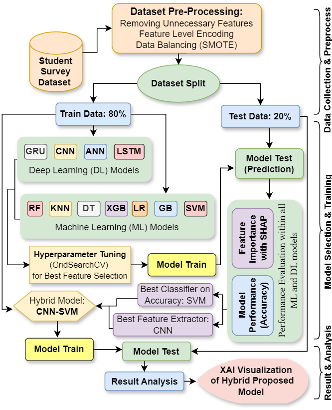

# Hybrid-CNN-SVM-Model-with-XAI-to-Predict-Anxiety
A hybrid CNN-SVM model, enhances anxiety prediction by combining CNN’s feature extraction with SVM’s classification. Trained on 2,028 GAD-7 responses from 15 Bangladeshi universities, it uses XAI to validate stressor relevance and improve prediction accuracy.

Read Full Dataset paper: https://files.osf.io/v1/resources/f7eax/providers/osfstorage/6645a403e8eec56ec46bed37?action=download&direct&version=2

  

Abstract: Perceived anxiety is a prevalent issue among university students, negatively affecting both mental health and academic outcomes. Prompt evaluation of anxiety triggered by academic factors is essential to promote student wellness and academic success. Recent studies have incorporated Machine Learning (ML) and Deep Learning (DL) models to assess academic anxiety. However, most of these investigations apply ML or DL models independently without thoroughly analyzing feature interpretation (i.e., academic stressors associated with anxiety) in relation to model efficiency. In this research, a hybrid model, AnxPred is introduced that combines neural network (CNN) and support vector machine (SVM) to improve the accu- racy of anxiety predictions through superior feature extraction. The rationale here is that CNN’s feature extraction capability combined with SVM’s classification ability would better extract the relevant mental stressors to achieve an accurate prediction of anxiety. The model is trained and validated using an extensive dataset of student academic anxiety measured by the GAD-7 model. A total of 2,028 responses are recorded from 15 leading universities in Bangladesh. In addition, Explainable Artificial Intelligence (XAI) is applied to assess the effectiveness of the model in extracting the relevant anxiety stressors to measure the anxiety level. The reported results suggest that the hybrid AnxPred model performs better than the conventional ML and DL models, achieving a precision of 99.125%, a recall of 99.125%, and a f1 score of 99.134%. The LIME (XAI) assessment indicates that the model reliably extracts relevant anxiety stressors to measure the level of anxiety. Therefore, the proposed model can be used for the diagnosis and early detection of mental anxiety in students and accordingly plan mental health counseling in an automated way, thus supporting the improvement of the academic process.